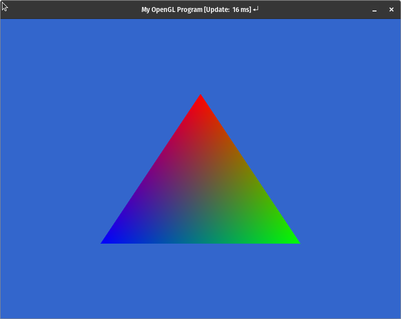

= Homework 4: OpenGL Basics
:author: Aaron Glick (glick094)
:docdate: 2025-11-14
:description: CSCI 5607 - Computer Graphics 1
:source-highlighter: pygments
:toc: left
:sectnums: |,all|

CSCI 5607 (Fall 2025)

== Part A - Compile and run provided demos
// (20 point each, 80 points total):

`BlankScreenSDL.cpp`

image::BlankScreenSDL.png[]
// video::TriangleColored.mp4[width=800,start=0,opts="autoplay,loop"]

=== `TriangleColored.cpp`

// video::TriangleColored.mp4[width=800,start=0,opts="autoplay,loop"]

=== `Cube3D.cpp`

video::Cube3D.mp4[width=800,start=0,opts="autoplay,loop"]

=== `CubeLit.cpp`

video::CubeLit.mp4[width=800,start=0,opts="autoplay,loop"]

=== `ModelLoad.cpp`

video::ModelLoad.mp4[width=800,start=0,opts="autoplay,loop"]

video::ModelLoadKnot.mp4[width=800,start=0,opts="autoplay,loop"]

== Part B - Quick Checks Questions 
// (5 point per problem, 20 points total):

=== Q1. 
*In `Cube3D.cpp` we call `glEnable(GL_DEPTH_TEST)`. Remove this call, how do you explain the resulting image?*

So commenting out that line we get the following: 

video::Cube3D_no_gl_depth_test.mp4[width=800,start=0,opts="autoplay,loop"]

The depth buffer prevent faces rendering in front while they are actually behind other faces. When enabled, OpenGL tests the depth value of a fragment against the content of the depth buffer, and if it passes the depth buffere is updated with the new depth value. If it fails, the fragment is discarded. 

=== Q2. 
*Currently, all of our examples exit when `Escape` is pressed. Update the code to also exit when the “Q” key is pressed. What did you need to change?*

All we need to do is change the line where we check the window events for key presses for `SDLK_ESCAPE`, we need to add the condition to check if we have a `SDLK_Q` key press. So we want either escape or q, so we add an OR. 

[source,cpp]
----
// if (windowEvent.type == SDL_EVENT_KEY_UP && windowEvent.key.key == SDLK_ESCAPE)
if (windowEvent.type == SDL_EVENT_KEY_UP && (windowEvent.key.key == SDLK_ESCAPE || windowEvent.key.key == SDLK_Q))
    quit = true;
----

=== Q3. 
*In `CubeLit.cpp` change the shader so the light is coming from below the cube. What change did you make?*

Within our `const GLchar* fragmentSource` definition, we just need to change the direction of the `lightDir` direction. 

[source,cpp]
----
// "const vec3 lightDir = vec3(0,1,1);"
"const vec3 lightDir = normalize(vec3(0,1,-1));"
----

++++

  

    <video controls autoplay loop src="CubeLit.mp4" style="width: 100%;">
      Your browser does not support the video tag.
    </video>
    
Lighting from above

  

  

    <video controls autoplay loop src="CubeLit_lighting_below.mp4" style="width: 100%; ">
      Your browser does not support the video tag.
    </video>
    
Lighting from below

  

++++

// .Lighting Above
// video::CubeLit.mp4[width=400,start=0,opts="autoplay,loop"]

// .Lighting Below
// video::CubeLit_lighting_below.mp4[width=400,start=0,opts="autoplay,loop"]

=== Q4. 
*Create a new model file, by hand, that contains a single large triangle. Load this model instead of the defaults. Upload a picture of the rendering of this large triangle.*

I've copied `ModelLoad.cpp` to `ModelLoadAG.cpp`. All I changed was the model. 

[source]
----
// --- Model Loading with Error Checking ---
// std::string file_name = "models/cube.txt";
std::string file_name = "models/triangleAG.txt";
----

video::Triangle3D.mp4[width=800,start=0,opts="autoplay,loop"]

// Actual triangleAG.txt file
// [source]
// ----
// 26
// -1.1
// -1.1
// 0.1
// 1
// 1
// 0
// 0
// -1
// -1.1
// 1.1
// 0.1
// 1
// 1
// 0
// 0
// -1
// 1.1
// 1.1
// 0.1
// 1
// 1
// 0
// 0
// -1
// ----

== Extra Credit: Programming Exercises 
// (1 point per problem, 8 points max):

// Complete any of the programming exercises as the end of the guide. These are of varying difficulties, feel free to choose the easiest ones. `=)`

=== Keyboard based camera controller `up, down, left, right`

// Add a key-board based camera controller to one of the 3D examples. One simple approach is to add new variables which get passed into the call of `glm::lookAt()`. These variables should then be modified based on key press events.

I added a camera controller that uses a spherical coordinate system centered on a target point (the origin). First, I set up the camera variables with spherical coordinates:

[source,cpp]
----
// Camera variables
glm::vec3 camPos = glm::vec3(3.0f, 0.0f, 0.0f);
glm::vec3 camTarget = glm::vec3(0.0f, 0.0f, 0.0f);
float camRadius = 3.0f;  // Distance from target
float camTheta = 0.0f;   // Angle around Z axis (azimuth)
float camPhi = 0.0f;     // Angle from XY plane (elevation)
----

The arrow keys modify `camTheta` and `camPhi` to rotate the camera around the target, while `I` and `O` keys adjust `camRadius` to zoom in/out. After each key press, I convert the spherical coordinates to Cartesian and update the camera position:

[source,cpp]
----
// Update camera position based on spherical coordinates
camPos.x = camTarget.x + camRadius * cos(camPhi) * cos(camTheta);
camPos.y = camTarget.y + camRadius * cos(camPhi) * sin(camTheta);
camPos.z = camTarget.z + camRadius * sin(camPhi);
----

This `camPos` is then passed to `glm::lookAt()` to create the view matrix each frame.

video::camera-controller.mp4[width=800,start=0,opts="autoplay,loop"]

=== Rotate and translate model on key presses

// Update `ModelLoad.cpp` to rotate and translate the model based on key presses

I implemented model transformations similar to the camera controller, but using the model matrix instead of the view matrix. First, I added variables to track the model's rotation and position:

[source,cpp]
----
// Model transformation variables
float modelRotX = 0.0f;  // Rotation around X axis
float modelRotY = 0.0f;  // Rotation around Y axis
float modelRotZ = 0.0f;  // Rotation around Z axis
glm::vec3 modelPos = glm::vec3(0.0f, 0.0f, 0.0f);  // Model position
----

When `SHIFT + arrow keys` are pressed, I update the rotation angles. When `CTRL + arrow keys` are pressed, I update the position. Then each frame, I apply both transformations to the model matrix:

[source,cpp]
----
glm::mat4 model = glm::mat4(1);
// Apply model transformations (order: translate, then rotate)
model = glm::translate(model, modelPos);
model = glm::rotate(model, modelRotZ, glm::vec3(0.0f, 0.0f, 1.0f));
model = glm::rotate(model, modelRotY, glm::vec3(0.0f, 1.0f, 0.0f));
model = glm::rotate(model, modelRotX, glm::vec3(1.0f, 0.0f, 0.0f));
----

The difference between model and camera transformations is that camera movement redefines where you're looking from (changing the view matrix), while model transformation changes where the object is in world space (changing the model matrix).

video::model-rotate.mp4[width=800,start=0,opts="autoplay,loop"]

video::model-translate.mp4[width=800,start=0,opts="autoplay,loop"]

=== Replace Phong specularity with Blinn-Phong model. What happens to the size of the highlight?

// Replace the phong specularity model in `ModelLoad.cpp` with Blinn-Phong. What happens to the size of the highlight?

To implement both specular models, I modified the fragment shader to support toggling between them. I added a uniform to select the shading model and implemented both approaches in the shader:

[source,cpp]
----
"uniform int shadingModel;" // 0 = Phong, 1 = Blinn-Phong
"const float shininess = 16.0;"
"void main() {"
"   // ... diffuse and ambient calculations ..."
"   float spec = 0.0;"
"   if (dot(lightDir,normal) > 0.0) {"
"     if (shadingModel == 0) {" // Phong
"       vec3 reflectDir = reflect(-lightDir, normal);"
"       spec = pow(max(dot(reflectDir, viewDir), 0.0), shininess);"
"     } else {" // Blinn-Phong
"       vec3 halfDir = normalize(lightDir + viewDir);"
"       spec = pow(max(dot(halfDir, normal), 0.0), shininess);"
"     }"
"   }"
"   vec3 specC = vec3(1.0,1.0,1.0)*spec;"
----

I made it toggleable with the `L` key. The Phong model computes the reflection of the light direction around the normal and checks how well it aligns with the view direction. Blinn-Phong instead uses the halfway vector between light and view directions, which is computationally cheaper. As you can see from the clip, the Blinn-Phong model shows a slightly brighter and wider specular highlight compared to Phong. 

video::toggle-blinnphong.mp4[width=800,start=0,opts="autoplay,loop"]

=== Update code to draw model with a random color, after pressing `c` key

// The vertex shader in `ModelLoad.cpp` hard codes the color to green. Update this code to instead draw the model loaded with a random color. Each time the user presses the `c` key change the model to a new random color.

To implement random colors, I first needed to change the vertex shader to accept color as a uniform instead of a hardcoded constant:

[source,cpp]
----
const GLchar* vertexSource =
  "#version 150 core\n"
  "in vec3 position;"
  "uniform vec3 inColor;"  // Changed from const to uniform
  // ... rest of shader
----

Then I added a color variable on the CPU side and initialized the random seed:

[source,cpp]
----
glm::vec3 modelColor = glm::vec3(0.0f, 0.7f, 0.0f);  // Default green
// ...
srand(time(NULL));  // Initialize random seed in main()
----

When the `c` key is pressed, I generate random RGB values and update the color:

[source,cpp]
----
case SDLK_C:
  modelColor.r = (float)rand() / RAND_MAX;
  modelColor.g = (float)rand() / RAND_MAX;
  modelColor.b = (float)rand() / RAND_MAX;
  printf("New color: (%.2f, %.2f, %.2f)\n", modelColor.r, modelColor.g, modelColor.b);
  break;
----

Finally, each frame I pass the color to the shader as a uniform:

[source,cpp]
----
glUniform3fv(glGetUniformLocation(shaderProgram, "inColor"), 1, glm::value_ptr(modelColor));
----

video::change-color.mp4[width=800,start=0,opts="autoplay,loop"]

=== Update `lightDir = const vec3(1,0,0)` to a uniform, and dynamically update to rotate around the model

// The vertex shader in `CubeLit.cpp` and `ModelLoad.cpp` hard codes the light to be shining in the direction of `(1,0,0)`. Change this value from a `const vec3` to a uniform, then dynamically update the direction to rotate around the model.

I made the light direction dynamic by first converting it from a shader constant to a uniform in both the fragment and vertex shaders:

[source,cpp]
----
const GLchar* fragmentSourcePhong =
  "#version 150 core\n"
  // ...
  "uniform vec3 lightDir;"  // Changed from const
  // ... rest of shader
----

Then I stored the light direction using spherical coordinates on the CPU side, similar to the camera controller:

[source,cpp]
----
// Light direction (spherical coordinates)
float lightTheta = glm::radians(45.0f);  // Angle around Z axis
float lightPhi = glm::radians(35.26f);   // Angle from XY plane
glm::vec3 lightDir = glm::normalize(glm::vec3(1.0f, 1.0f, 1.0f));
----

When `ALT + arrow keys` are pressed, I update the spherical angles and convert them to a normalized Cartesian direction vector:

[source,cpp]
----
// Update light direction based on spherical coordinates
lightDir.x = cos(lightPhi) * cos(lightTheta);
lightDir.y = cos(lightPhi) * sin(lightTheta);
lightDir.z = sin(lightPhi);
lightDir = glm::normalize(lightDir);
----

Finally, each frame I pass the light direction to the shader as a uniform:

[source,cpp]
----
glUniform3fv(glGetUniformLocation(shaderProgram, "lightDir"), 1, glm::value_ptr(lightDir));
----

video::change-lightDir.mp4[width=800,start=0,opts="autoplay,loop"]

// This allows real-time visualization of how lighting direction affects diffuse and specular highlights.

=== Update lighting to support point lights.

DID NOT IMPLEMENT

// The shaders used in `CubeLit.cpp` and `ModelLoad.cpp` support a directional light model. This means the strength of the lighting depends only on the direction of the light, not it's distance. Update the code to support a point light. This change involves two steps. One, the direction that was statically stored in `inlight- Dir` should now be dynamically computed to point from the pos of the part of the model that is being rendered to current position of the light. Two, the strength of the light should be divided by the distance form the light, squared (i.e., further way lights should have less impact)

=== Update Gouraud shading

// The code shown in `CubeLit.cpp` and `ModelLoad.cpp` computes the full Phong lighting model for each pixel. This leads to a nice image, but can be expensive to compute. Re-write the shaders to move the entire lighting computation to the vertex shader. This approach is known as Gouraud shading, and can be much faster as the lighting is only computed once per vertex.
By default, the graphics card will quickly interpolate the computer color between vertices. Is the rendering quality noticeably different? Which is faster?

I implemented Gouraud shading by creating a separate shader program that performs all lighting calculations in the vertex shader. The vertex shader computes the full lighting model (diffuse, ambient, and specular) per vertex:

[source,cpp]
----
const GLchar* vertexSourceGouraud =
  "#version 150 core\n"
  "in vec3 position;\n"
  "uniform vec3 inColor;\n"
  "in vec3 inNormal;\n"
  "out vec3 finalColor;\n"  // Output final color, not normal/pos
  "uniform mat4 model;\n"
  "uniform mat4 view;\n"
  "uniform mat4 proj;\n"
  "uniform int shadingModel;\n"
  "uniform vec3 lightDir;\n"
  "const float ambient = .3;\n"
  "const float shininess = 16.0;\n"
  "void main() {\n"
  "   gl_Position = proj * view * model * vec4(position,1.0);\n"
  "   vec3 pos = (view * model * vec4(position,1.0)).xyz;\n"
  "   vec4 norm4 = transpose(inverse(view*model)) * vec4(inNormal,0.0);\n"
  "   vec3 normal = normalize(norm4.xyz);\n"
  "   \n"
  "   // Compute lighting per-vertex\n"
  "   vec3 diffuseC = inColor*max(dot(lightDir,normal),0.0);\n"
  "   vec3 ambC = inColor*ambient;\n"
  "   vec3 viewDir = normalize(-pos);\n"
  "   float spec = 0.0;\n"
  "   if (dot(lightDir,normal) > 0.0) {\n"
  "     if (shadingModel == 0) {\n"
  "       vec3 reflectDir = reflect(-lightDir, normal);\n"
  "       spec = pow(max(dot(reflectDir, viewDir), 0.0), shininess);\n"
  "     } else {\n"
  "       vec3 halfDir = normalize(lightDir + viewDir);\n"
  "       spec = pow(max(dot(halfDir, normal), 0.0), shininess);\n"
  "     }\n"
  "   }\n"
  "   vec3 specC = vec3(1.0,1.0,1.0)*spec;\n"
  "   finalColor = diffuseC + ambC + specC;\n"  // Compute final color here
  "}";
----

The fragment shader is then greatly simplified - it just outputs the interpolated color:

[source,cpp]
----
const GLchar* fragmentSourceGouraud =
  "#version 150 core\n"
  "in vec3 finalColor;\n"
  "out vec4 outColor;\n"
  "void main() {\n"
  "   outColor = vec4(finalColor, 1.0);\n"
  "}";
----

I made it toggleable with the `G` key to switch between Gouraud (per-vertex) and Phong (per-fragment) lighting. The key difference is visible on curved surfaces like the teapot: Gouraud shading produces faceted, less accurate specular highlights since they're only computed at vertices and linearly interpolated, while Phong shading computes lighting at every pixel for more accurate, smoother results.

video::toggle-gouraud.mp4[width=800,start=0,opts="autoplay,loop"]

=== Support Wavefront OBJ files

DID NOT IMPLEMENT

// The Wavefront OBJ file format is a popular way to store 3D content, that is widely supported by many tools. The OBJ format is only slightly more complex than the format used here. The main change is that it first lists all vertex positions, then an UV texture coordinates, then all vertex normals, and finally builds the triangles out of vertices by choosing one of the positions, texture coordinates, and vertex normals listed at the start of the file. You can read a detailed description of the format at https://en.wikipedia.org/wiki/Wavefront_.obj_file. Write a program that converts the vertex data stored in OBJ files to the format used here.

// Tip 1: OBJ files allow arbitrary convex polygons (not just triangles). But you can safely assume these vertices will be sorted (typically counter-clockwise), allowing you to easily convert a polygon of n verticies into n  2 triangles.
// Tip 2: This type of file conversion is typically best done in a scripting language such as python.

// By adding OBJ support 3D projects can include a wide variety of models readily available online, greatly enhancing the quality of the results, and the fun of working on the project

== Summary

Overall, I spent some time understanding how the C++ code interacts with the shaders. I think add the keyboard presses and toggles for changing the lighting models took a little extra effort, but really clearly shows what I was getting at when I wanted to see the difference in each extra credit task. I wanted to get the OBJ files working, but I did not have enough time. 

== Access source code

You can access the source code here: https://drive.google.com/file/d/1-maMjgUYL3d3iDAd9TGbULiztE_Omxiw/view?usp=sharing, which was compiled on a linux machine. 

To compile: 
`cmake -S . -B build && cmake --build build`

To run `Cube3D` and other programs: 
`./build/Cube3D`
